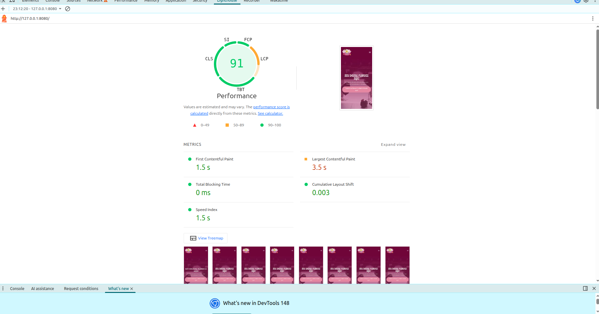

### Projeto Final — Landing Page

A ideia deste projeto surgiu durante o desenvolvimento do trabalho final de uma disciplina, com o objetivo de aplicar na prática os conhecimentos adquiridos em HTML e CSS.

Para tornar o projeto mais pessoal e próximo da realidade, a landing page foi desenvolvida para a agência de publicidade da minha namorada, buscando representar visualmente a identidade da empresa e apresentar seus serviços de forma moderna, organizada e responsiva.

#### 1. Estrutura semântica
Foi criada toda a estrutura do site utilizando tags HTML semânticas, visando melhorar a organização do código, acessibilidade e boas práticas de desenvolvimento.

#### 2. Sistema de design
Foi desenvolvido um sistema de estilos utilizando variáveis CSS para padronizar cores primárias, secundárias e terciárias, além de definir fontes, tamanhos de texto, espaçamentos e cores de fundo, facilitando a manutenção e escalabilidade do projeto.

#### 3. Layout e organização
As seções do site foram estruturadas utilizando Flexbox e CSS Grid. O Flexbox foi aplicado principalmente em áreas de alinhamento horizontal, enquanto o Grid foi utilizado em seções como os cards de serviços prestados pela agência.

#### 4. Responsividade
A responsividade do projeto foi garantida através de media queries e breakpoints adequados, permitindo uma boa experiência em diferentes tamanhos de tela.

#### 5. Animações e interações
Foram adicionadas pequenas animações e efeitos de transição para tornar a navegação mais dinâmica e agradável, sem comprometer o desempenho ou a experiência do usuário.

#### 6. Utilização de IA no desenvolvimento
A seção de cards de serviços foi inicialmente desenvolvida de forma simples, contendo apenas a estrutura básica em Grid. Após isso, foi utilizado um prompt na IA do composer 2.5 do 'Cursor' o objetivo de melhorar visualmente a seção e deixá-la mais alinhada com a identidade visual do restante do site.

O prompt utilizado foi:

> “Melhore essa seção de cards, deixe-a mais parecida com a identidade visual do restante do site, usando as cores e fontes, melhore o marcador da lista para que ele fique com a paleta de cores da marca e adicione uma pequena animação de hover nos cards.”

A IA realizou sugestões relacionadas principalmente ao CSS, adicionando novas classes, variáveis e ajustes visuais para melhorar a aparência dos cards e a consistência visual da página.

#### Validação e ajustes
Após as alterações geradas pela IA, foi realizada uma code-review para validar se as modificações realmente faziam sentido dentro do contexto do projeto. Algumas partes desnecessárias foram removidas e também foram feitos testes em diferentes tamanhos de tela.

Durante os testes, foi identificado que o layout apresentava problemas em resoluções próximas de 1100px de largura. Para corrigir isso, foi adicionada uma media query específica realizando os ajustes necessários na estrutura da seção.

#### 7. Aplicação do dark mode no site
Adicionei o  color-scheme: light nas cores que eu ja tinha no sistema, e criei o    color-scheme: dark; com as cores do modo escuro

#### 9. Performance
Resultado do Lighthouse com pontuação próxima de 100:

